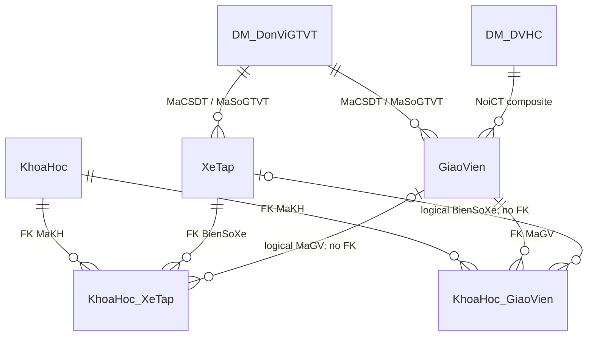

# Bản đồ quan hệ xe–giáo viên CSDL_OTO

## Sơ đồ đã xác minh

`KhoaHoc_XeTap` có thể biểu diễn hai mức:

- `IsKhoaHocXeTap=1`: phân xe ở cấp khóa;
- `IsKhoaHocXeTap=0`: một slot/lịch sử dụng với `NgayBD/NgayKT`, có thể kèm `MaGV`, `MaHV`, địa điểm.

`KhoaHoc_GiaoVien` tương tự:

- `IsKhoaHocGiaoVien=1`: giáo viên thuộc khóa;
- giá trị khác `1`: slot lịch làm việc có `NgayBD/NgayKT`.

## Physical FK và liên kết logic

| Từ | Sang | Cột | Enforcement nguồn |
|---|---|---|---|
| `XeTap` | `DM_DonViGTVT` | `MaCSDT`, `MaSoGTVT` | FK |
| `GiaoVien` | `DM_DonViGTVT` | `MaCSDT`, `MaSoGTVT` | FK |
| `GiaoVien` | `DM_DVHC` | `NoiCT_MaDVQL` + `NoiCT_MaDVHC` | Composite FK |
| `KhoaHoc_XeTap` | `KhoaHoc` | `MaKH` | FK |
| `KhoaHoc_XeTap` | `XeTap` | `BienSoXe` | FK |
| `KhoaHoc_XeTap` | `GiaoVien` | `MaGV` | Không FK |
| `KhoaHoc_XeTap` | học viên | `MaHV` | Không FK; kiểu `nvarchar(50)` |
| `KhoaHoc_GiaoVien` | `KhoaHoc` | `MaKH` | FK |
| `KhoaHoc_GiaoVien` | `GiaoVien` | `MaGV` | FK |
| `KhoaHoc_GiaoVien` | `XeTap` | `BienSoXe` | Không FK |
| `GiaoVien` | `QTHT_NguoiDung` | — | Không có quan hệ |

Không FK nào trong nhóm trên dùng cascade. Tuy nhiên nhiều stored procedure chủ động physical delete quan hệ.

## Cardinality và identity của quan hệ

| Object | PK | Natural/source identity đề xuất | Ghi chú |
|---|---|---|---|
| `KhoaHoc_XeTap` | `MaLichSD int identity` | `(profile, MaLichSD)` | Không dùng `(MaKH, BienSoXe)` vì một xe có nhiều slot |
| `KhoaHoc_GiaoVien` | `MaLichLV int identity` | `(profile, MaLichLV)` | Không dùng `(MaKH, MaGV)` vì có thể có nhiều lịch/môn |

Các procedure delete theo `(MaKH, BienSoXe)` hoặc `(MaKH, MaGV)` cộng flag cấp khóa có thể tác động nhiều dòng. Target phải giữ source relation ID, không suy ra relation identity từ cặp khóa nghiệp vụ.

## Snapshot hiện tại

| Chỉ số | Kết quả |
|---|---:|
| `KhoaHoc` | `4` |
| `KhoaHoc_XeTap` | `0` |
| `KhoaHoc_GiaoVien` | `8` |
| Giáo viên distinct trong quan hệ active | `8` |
| Quan hệ có biển số xe | `0` |
| Xe/giáo viên được nối qua `KhoaHoc_XeTap` | `0 / 0` |
| Giáo viên không có quan hệ active | `40` |
| Physical/logical orphan | `0` |

Orphan bằng 0 trong bảng rỗng không chứng minh pipeline tương lai an toàn. Hai liên kết logic thiếu FK phải luôn được kiểm tra trong từng sealed plan.

## Quy tắc lịch đã chứng minh

- Thời điểm bắt đầu phải nhỏ hơn thời điểm kết thúc.
- Lịch phải nằm trong khoảng khóa học.
- Không cho trùng giờ đối với cùng `MaGV` trong các dòng lịch giáo viên active.
- Không cho trùng giờ đối với cùng `BienSoXe` trong các dòng lịch xe active.
- Kiểm tra hiện hành dựa trên procedure và trạng thái nguồn; không có database exclusion constraint.

## Mô hình target đề xuất

1. Master vehicle và teacher được nạp trước.
2. Course master được resolve theo `(profile, source course key)`.
3. Relation dùng source relation ID, FK đến target master IDs và giữ source codes chỉ để audit.
4. Slot lịch tách khỏi membership cấp khóa bằng một enum/constraint rõ, không chỉ bit tên khó hiểu.
5. Teacher–vehicle “quản lý” trong QLHV là quan hệ QLHV-owned riêng; không suy ra từ một slot lịch nguồn.
6. User account link là nullable, QLHV-owned, one-to-one có unique filtered index; nguồn không được ghi đè.
7. Quan hệ mất khỏi nguồn chuyển `MISSING_AT_SOURCE/REVIEW`, không hard-delete.
