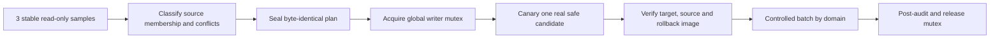

# Các phương án đồng bộ xe và giáo viên

## So sánh

| Tiêu chí | Đọc trực tiếp CSDL_OTO | Batch có kiểm soát | Direct realtime bằng CT |
|---|---|---|---|
| Độ phức tạp | Thấp ở read path, cao ở bảo mật/availability | Trung bình | Cao |
| Ownership | Dễ lẫn source/QLHV | Tách rõ qua mapping | Bắt buộc column ownership policy |
| Duplicate guard | Chạy mỗi request, khó review | Preview + sealed conflict plan | Phải guard từng event và reconcile |
| Delete semantics | Hiển thị trạng thái nguồn trực tiếp | Soft-inactive/review an toàn | Cần tombstone/membership state machine |
| Ảnh/tệp | Source path không an toàn cho client | Copy/scan/hash vào managed store | Event không chứa file; cần queue riêng |
| Checkpoint | Không | Batch run/snapshot token | Bắt buộc, riêng từng table/domain |
| Rollback | Không mutation nhưng phụ thuộc nguồn | Exact batch/canary rollback | Event journal + replay/compensation |
| Auto Sync | Không writer conflict nhưng tăng tải nguồn | Phải mutual exclusion | Phải cùng global writer mutex |
| Learner realtime | Query load có thể cạnh tranh | Lịch riêng, partition riêng | Không dùng chung checkpoint/cycle |
| Audit | Hạn chế nếu chỉ query | Tốt: plan/run/result | Tốt nếu có event journal |
| Khi nguồn offline | Không dùng được | Dùng snapshot target cuối | Dùng target, đánh dấu stale |

## Điều kiện thực tế hiện tại

- Database CT đang bật, nhưng chỉ track `DM_DVHC`, `DM_HangDT`, `KhoaHoc`, `NguoiLX`, `NguoiLX_HoSo`.
- `XeTap`, `GiaoVien`, `KhoaHoc_XeTap` và `KhoaHoc_GiaoVien` chưa được CT.
- `App_GiaoVien` và `App_KhoaHoc_GiaoVien` đã có full-snapshot pipeline, nhưng mapper ngày sinh/ảnh không phù hợp data hiện tại.
- `App_XeTap` và `App_KhoaHoc_XeTap` chưa có source identity/checkpoint contract và chưa có pipeline.
- Auto Sync đang OFF trong nghiên cứu; không pipeline nào được chạy.

## Khuyến nghị riêng cho Vehicle

Chọn controlled batch trước.

Lý do: chỉ 29 row, biến động thấp, source có identity rõ nhưng target còn thiếu source metadata và source relation đang rỗng. Batch cho phép kiểm tra secondary duplicate, bốn xe bảo hiểm không hiệu lực và absolute photo paths trước mỗi write. Đọc trực tiếp chỉ phù hợp cho màn hình quan sát tạm thời có cache/circuit breaker, không phù hợp làm master vận hành. CT chỉ sau khi có schema target, file pipeline, relation identity và một change-tracking enablement task được phê duyệt riêng.

## Khuyến nghị riêng cho Teacher

Chọn controlled batch đã sửa contract, tận dụng nhưng không chạy mù pipeline snapshot hiện có.

Lý do: 48/48 teacher và 8/8 relation đã ở target, nên ưu tiên repair/backfill ngày sinh và ảnh, bổ sung API/UI/PII controls. Trước mỗi batch phải seal source identity/hash, kiểm tra CCCD collision và empty-partition. Direct read làm lộ coupling/PII và mất khả năng offline. CT chỉ có giá trị sau khi master và relation đều tracked; không bật CT riêng master rồi bỏ relation.

## Kiến trúc batch đề xuất

Các domain tách riêng: `VEHICLE_MASTER`, `TEACHER_MASTER`, `COURSE_VEHICLE_RELATION`, `COURSE_TEACHER_RELATION`, `VEHICLE_MEDIA`, `TEACHER_MEDIA`. Master phải hoàn tất trước relation; media có retry/dead-letter riêng và không làm rollback business row nếu file source tạm unavailable.

## Guard vận hành bắt buộc

- Auto Sync và mọi writer khác không có active run/slot; cùng global mutex với learner realtime.
- Database/profile/center identity đúng; không dùng `_BAK` làm nguồn nghiệp vụ.
- Ba mẫu counts/fingerprints ổn định trước seal; plan đọc hai lần byte-identical.
- Duplicate, natural-key conflict, relation orphan, mapping, media path, rollback và empty-partition đều PASS.
- Candidate phải là dữ liệu thật; không tạo mutation giả.
- Checkpoint riêng domain/profile; CT retention/min-valid-version guard nếu triển khai realtime.
- Mất nguồn không hard-delete; source offline chỉ đánh dấu stale.
- Canary rollback chỉ đúng target identity đã seal.

## Vì sao không gộp vào learner realtime ngay

Xe/giáo viên có identity, PII, file, relation và delete semantics khác học viên. Việc dùng chung worker process có thể hợp lý về hosting, nhưng control plane, checkpoint, retry, ownership policy và health signal phải tách riêng. Một lỗi ảnh giáo viên không được chặn checkpoint học viên; một empty vehicle snapshot không được ảnh hưởng learner membership.
