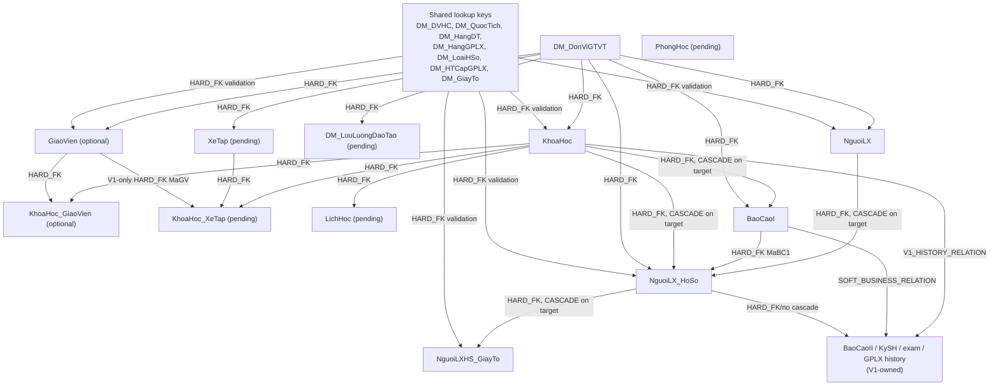

# V2 → V1 delete and dependency matrix

Audit date: `2026-07-25`  
Approval state: `PENDING`  
Implementation state: design only; current worker does not implement this contract.

## 1. Critical findings

- Change Tracking is disabled on all four live databases and zero tables are tracked.
- CDC is also disabled.
- `ALLOW_SNAPSHOT_ISOLATION` and `READ_COMMITTED_SNAPSHOT` are both off on all four live databases.
- The current worker inserts/updates business tables and records tombstones, but has no business-row delete or deactivate writer.
- The current test suite explicitly protects the old no-delete behavior. That behavior is obsolete under this contract.
- All 13 candidate tables have a usable PK, including composite keys, so Change Tracking can provide a sufficient technical delete key after CT is enabled.
- A CT delete tombstone contains only the PK. For most tables that is not enough to reconstruct the CSDT partition. A durable per-stream membership registry is therefore mandatory.
- `TrangThai=0` is not a universal delete solution: some V1 selection branches filter it, while other BCII/history branches do not.

Until CT/membership and safe deactivation are approved and implemented, a delete-required cycle must fail closed and must not advance its checkpoint.

## 2. Dependency graph



`BaoCaoII`, `KySH`, result/decision columns, and `NguoiLX_GPLX` are never forward-written. Their edges exist to prevent destructive parent operations.

## 3. INSERT/UPDATE order

One enabled cycle applies parent before child:

1. Validate, but do not overwrite, shared lookup keys.
2. `DM_DonViGTVT`.
3. Optional/pending resource masters when enabled: `GiaoVien`, `XeTap`, `DM_LuuLuongDaoTao`, `PhongHoc`.
4. `KhoaHoc`.
5. Course children when enabled: `KhoaHoc_GiaoVien`, `KhoaHoc_XeTap`, `LichHoc`.
6. In either order after their parents: `BaoCaoI` and `NguoiLX`.
7. `NguoiLX_HoSo` after `KhoaHoc`, `BaoCaoI`, and `NguoiLX`; nullable `MaBC1` does not waive validation when non-null.
8. `NguoiLXHS_GiayTo`.

All parent rows and lookup keys must be present in the staged plan before any target write begins. The live aggregate FK audit found zero current source and target orphans, but this is a per-cycle gate, not a one-time assurance.

## 4. DELETE order

Delete processing is the exact reverse dependency order:

1. `NguoiLXHS_GiayTo`, `KhoaHoc_GiaoVien`, `KhoaHoc_XeTap`, `LichHoc`.
2. `NguoiLX_HoSo` after checking all V1-owned history and `NguoiLX_GPLX`.
3. `BaoCaoI` and `NguoiLX`.
4. `KhoaHoc`.
5. `GiaoVien`, `XeTap`, `DM_LuuLuongDaoTao`, `PhongHoc`.
6. `DM_DonViGTVT` last.

No SQL Server cascade is used as the sync algorithm. Before a parent hard delete, the cycle must prove that every cascading child is V2-owned and already covered by the same delete plan. Otherwise a cascade could remove V1-owned history.

## 5. Per-table delete policy

| Table | V2 delete detected by | Child delete order | Hard delete allowed when | V1 history evidence | Preserve method | Final rule |
| --- | --- | --- | --- | --- | --- | --- |
| DM_DonViGTVT | CT PK MaDV or membership reconcile | all scoped descendants first | never automatically for a national target row | many business FKs and target has 1,579 rows | deactivate only after a verified active-row predicate; otherwise block | DEACTIVATE_PRESERVE_V1_HISTORY |
| GiaoVien | CT PK MaGV or membership reconcile | KhoaHoc_GiaoVien/KhoaHoc_XeTap first | no target relation/history exists | target adds HangGPLX FK and KhoaHoc_XeTap relation | TrangThai plus verified exclusion; otherwise block | DEACTIVATE_PRESERVE_V1_HISTORY |
| KhoaHoc | CT PK MaKH or membership reconcile | relations, LichHoc, BaoCaoI, dossier first | no dossier, BCI, BCII, or other history exists | target cascades to BaoCaoI and dossier; BCII soft relation | retain row and exclude from new business; block if exclusion is unproven | DEACTIVATE_PRESERVE_V1_HISTORY |
| KhoaHoc_GiaoVien | CT PK MaLichLV or membership reconcile | none | row is V2-owned and has no V1 history | no V1 downstream evidence found | hard delete; idempotent not-found is success | HARD_DELETE |
| BaoCaoI | CT PK MaBCI or membership reconcile | dossier relation first | no dossier and no BaoCaoII relation/history | V1 forms BCII from BCI | retain BCI for history and exclude from new BCII | DEACTIVATE_PRESERVE_V1_HISTORY |
| NguoiLX | CT PK MaDK or membership reconcile | dossier then documents first | no dossier, GPLX, BCII, exam, or other V1 history | V1 GPLX and dossier history can depend on learner | TrangThai plus verified exclusion; otherwise block | DEACTIVATE_PRESERVE_V1_HISTORY |
| NguoiLX_HoSo | CT PK MaDK or membership reconcile | documents first | no BCII/exam/GPLX/history signal exists | shared table contains all downstream result/decision columns | preserve row/history and make it ineligible for new business; block if no universal predicate | DEACTIVATE_PRESERVE_V1_HISTORY |
| NguoiLXHS_GiayTo | CT composite PK MaGT+MaDK or membership reconcile | none | newly staged/unconsumed document only | V1 legacy delete deactivates documents | use TrangThai=0 only after all document consumers are verified | DEACTIVATE_PRESERVE_V1_HISTORY |
| XeTap | CT PK BienSoXe or membership reconcile | KhoaHoc_XeTap first | policy and history ownership approved | zero live rows; insufficient evidence | fail closed | UNKNOWN |
| KhoaHoc_XeTap | CT PK MaLichSD or membership reconcile | none | ownership and MaGV rule approved | zero live rows; target adds MaGV FK | fail closed | UNKNOWN |
| DM_LuuLuongDaoTao | CT composite PK MaCSDT+HangGPLX or membership reconcile | none | ownership approved and no history consumer | zero live rows | fail closed | UNKNOWN |
| LichHoc | CT PK MaLichHoc or membership reconcile | none | ownership and retention approved | zero live rows | fail closed | UNKNOWN |
| PhongHoc | CT PK MaPH or membership reconcile | none | ownership and CSDT scope approved | no partition key and zero rows | fail closed | UNKNOWN |

For every `DEACTIVATE_PRESERVE_V1_HISTORY` rule:

1. A hard delete is permitted only when an in-transaction history probe proves no V1-owned relation and no cascading V1 data.
2. Otherwise the approved deactivation must make the row ineligible for every new BCII/exam/training-selection path while keeping historical reads intact.
3. If that predicate cannot be proven, the operational fallback is `BLOCK_DELETE_CONFLICT`; the cycle remains incomplete and its checkpoint does not move.
4. A tombstone/journal row alone is never convergence.

## 6. Change Tracking delete contract

### 6.1. Current state

```text
CSDL_OTO:     CT disabled, tracked tables 0
CSDL_OTO_V1:  CT disabled, tracked tables 0
CSDL_MOTO:    CT disabled, tracked tables 0
CSDL_MOTO_V1: CT disabled, tracked tables 0
```

Realtime delete handling is therefore not currently executable.

### 6.2. Key sufficiency

After CT is enabled:

- every candidate table has a PK;
- CT returns every PK column for DELETE, including `NguoiLXHS_GiayTo(MaGT,MaDK)` and `DM_LuuLuongDaoTao(MaCSDT,HangGPLX)`;
- CT does not return non-key scope columns after deletion;
- the key is sufficient to address the row, but not always sufficient to prove that the row belonged to a particular CSDT stream.

### 6.3. Durable membership registry

For every successfully observed source row, keep a durable record:

```text
source profile
stream/CSDT
table
canonical key hash
first-seen cycle
last-seen cycle
active/deleted state
mapping fingerprint
```

Raw learner keys and PII must not appear in diagnostics. If the actual key is required for an idempotent target action, protect it as operational state and never expose it in reports/logs.

A CT delete is eligible only when its key resolves to an active registry entry for that stream. This prevents one CSDT stream from deleting another center's target row.

### 6.4. Full reconcile

Full reconcile compares the complete staged source key set to the stream membership registry:

```text
registry active key absent from complete source snapshot
    => target-only candidate for that stream
    => apply the table delete policy
```

It must not compare the source directly with every target row. For example, `DM_DonViGTVT` has 38 source rows and 1,579 target rows; a blind target anti-join would misclassify national/V1-owned rows as deletions.

The registry entry becomes inactive only in the same logical commit as the hard delete/deactivation. A failed delete leaves it active for retry.

## 7. Same-cycle consistency contract

### 7.1. Source phase

1. Acquire a per-source-profile/per-stream cycle lease.
2. Start one source `SNAPSHOT` transaction for all enabled mapped tables.
3. Capture one source CT watermark inside that transaction.
4. Read bounded CT changes and the required base rows for every table.
5. Materialize the complete immutable stage, including current source membership for delete reconciliation.
6. End the source transaction only after staging has completed.

If snapshot isolation or an equivalent consistent database snapshot is unavailable, the cycle fails before target writes. Independent current reads are not a same-cycle snapshot.

That is the current live state: both snapshot options are off. Same-cycle source consistency therefore needs an approved database setting change or an equivalent immutable snapshot/staging mechanism before implementation can claim this contract.

### 7.2. Validation phase

Validate before writing:

- source/target schema fingerprints;
- every table and column has an approved non-unknown disposition;
- PK uniqueness and collision guards;
- partition/membership ownership;
- transforms, length, nullability, enum and range;
- parent existence and FK plan;
- conditional-merge states;
- V1 history probes and delete/deactivate eligibility.

Unknown or new columns fail closed. An enabled optional domain may leave the cycle at `PARTIAL_OPTIONAL`, but there is only one publishable source-watermark checkpoint for the cycle. That global checkpoint cannot advance, and a later cycle cannot start, until every enabled mapped domain has completed. A domain that remains `DISABLED_PENDING_MAPPING` is not enabled.

### 7.3. Target phase

All core writes are in one transaction in the single target database:

1. acquire a target stream lock;
2. apply parent INSERT/UPDATE;
3. apply child INSERT/UPDATE;
4. apply child-to-parent DELETE/deactivate;
5. verify row counts, constraints, preserved-column hashes, and absence of unresolved core conflicts;
6. write a target-side cycle commit marker;
7. commit.

A full target transaction is technically feasible because all business tables for one profile are in one target database. It must be bounded and monitored for lock/log impact; staging occurs before the transaction to keep it short.

Optional domains may use a second target transaction after the core target transaction commits. Their failure does not require rollback of already committed core target writes, but those writes are only a recoverable sub-transaction of the same cycle: the target marker remains `PARTIAL_OPTIONAL`, no global/source-watermark checkpoint is published, the next cycle is blocked, and the same cycle/watermark must be retried until every enabled mapped domain succeeds.

### 7.4. Checkpoint/commit protocol

The worker state/checkpoint can be in a different database from the target. Do not rely on an implicit distributed transaction. Use a durable cycle journal:

```text
PREPARING
  -> STAGED
  -> VALIDATED
  -> CORE_TARGET_COMMITTED (recoverable target marker; not a checkpoint)
       -> ALL_ENABLED_DOMAINS_COMMITTED
            -> CHECKPOINT_PUBLISHED
                 -> COMPLETE
       -> PARTIAL_OPTIONAL (enabled optional domain incomplete)
            -> retry same cycle/watermark
                 -> ALL_ENABLED_DOMAINS_COMMITTED
```

The target commit marker contains cycle ID, source watermark, mapping fingerprint, staged-key-set hash, result hashes for every enabled mapped domain, and commit time. `CHECKPOINT_PUBLISHED` is reachable only from `ALL_ENABLED_DOMAINS_COMMITTED`. The external/global checkpoint advances only after the complete marker is read back and verified; per-domain progress markers are recovery metadata and are never independently publishable checkpoints.

### 7.5. Crash recovery and idempotency

| Failure point | Recovery |
| --- | --- |
| before target transaction | discard/rebuild stage using the same or a newer bounded cycle |
| during target transaction | SQL rollback; retry the same cycle |
| after all enabled target domains commit, before checkpoint | detect complete target marker; verify all enabled-domain hashes; publish the single global checkpoint without replay, or idempotently replay if verification requires it |
| after core target commit, enabled optional failure | retain committed core target writes and recovery markers, but do not publish/advance the global source-watermark checkpoint; block the next cycle and retry the failed optional domain against the same immutable cycle/watermark |
| expired CT retention | do a complete source snapshot plus membership reconcile; never infer deletes from target-global rows |

INSERT is `insert-if-absent by immutable key`; UPDATE writes only mapped V2-owned/conditional columns; DELETE/deactivate is repeatable; already-absent/already-inactive is success only after ownership/history validation.

## 8. Implementation gaps found, not changed

- Current processing captures a watermark but commits each domain independently.
- A parent failure does not universally prevent later domain processing/checkpoint movement.
- Full snapshots are independent current reads, not one cross-table snapshot.
- CT base-row joins can observe values newer than the bounded change version.
- Tombstones never reach a business delete/deactivate writer.
- Existing tests enforce no business DELETE and the obsolete lifecycle rules.

These gaps are documented for owner approval only. No code, SQL, configuration, patch, or sync execution was performed by this audit.
