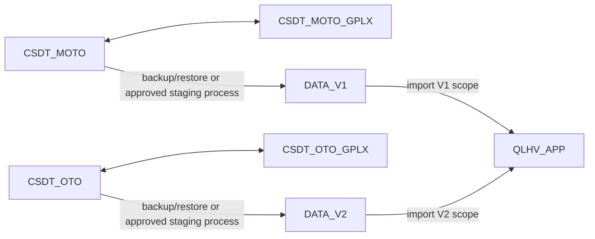

# Sync data flow architecture

This document describes the planned multi-source data flow for QLHV_APP.
It is architecture documentation only. It does not create databases and does not approve execute.

## Planned profiles

The architecture uses these fixed connection profiles:

1. `CSDT_MOTO`
2. `CSDT_OTO`
3. `CSDT_MOTO_GPLX`
4. `CSDT_OTO_GPLX`
5. `DATA_V1`
6. `DATA_V2`
7. `QLHV_APP`

These profiles are configuration slots.
They may be unconfigured, configured, test failed, test succeeded, active, or inactive.
The application must not require all 7 profiles to exist before running.

Profile configuration and status should be managed through a QLHV_APP Admin menu, for example
`He thong / Cau hinh ket noi CSDT` or `Quan tri / Ket noi CSDL`.
The bootstrap `QLHV_APP` connection can still come from protected server configuration in the first stage, while the
other CSDT/DATA profiles are stored in `QLHV_APP` with encrypted passwords and masked UI display.

## Business data flow

The exact mapping between MOTO/OTO and V1/V2 still needs business confirmation.
The key architectural rule is that operational sources are first staged/restored into import profiles, then imported
into `QLHV_APP`.

## Readiness by operation

Each operation checks only the profiles it needs.

| Operation | Required profiles | Writes? | Notes |
| --- | --- | --- | --- |
| Connection status screen | Any profile | No | Can show missing/unconfigured profiles safely. |
| Test one profile | Selected profile only | No app data write | May update audit/status later; no secrets returned. |
| Restore/prepare V1 source | Source profile plus `DATA_V1` | Outside current sync execute | Must be an explicit admin operation. |
| Restore/prepare V2 source | Source profile plus `DATA_V2` | Outside current sync execute | Must be an explicit admin operation. |
| Dry-run V1 import | `DATA_V1`, `QLHV_APP` | No | Reads source and target counts/mapping only. |
| Dry-run V2 import | `DATA_V2`, `QLHV_APP` | No | Reads source and target counts/mapping only. |
| Execute V1 import | `DATA_V1`, `QLHV_APP` | Yes | Requires guards, authorization, backup/snapshot. |
| Execute V2 import | `DATA_V2`, `QLHV_APP` | Yes | Requires guards, authorization, backup/snapshot. |

The menu should show all 7 fixed profiles at all times, but a failed or missing profile must block only operations
that need that profile.

## Import boundaries

Imports into QLHV_APP must be source-scoped:

- Importing `DATA_V1` must not delete, overwrite, or hide valid `DATA_V2` records unless a reviewed merge rule says so.
- Importing `DATA_V2` must not delete, overwrite, or hide valid `DATA_V1` records unless a reviewed merge rule says so.
- Target rows should preserve source identity, such as `SourceSystem`, `SourceProfile`, or another stable source marker.
- Change detection should include the source scope so two sources cannot accidentally compete for the same target row.

## Current Task 5 relationship

Current Task 5 work has a single-source V2 path:

- config-check
- dry-run
- source diagnostics
- target diagnostics
- guarded execute path
- WIP pre-execute plan on a separate branch

That work remains useful as a technical foundation, but it is not enough for the final multi-source import model.

Before any execute test beyond the current local single-source experiment, the team must decide:

- whether `CSDT_V2` becomes `DATA_V2`;
- whether V1/V2 imports share one pipeline with a profile selector;
- how target uniqueness works when V1 and V2 contain similar or overlapping learners;
- which fields are source-specific and which fields are globally merged.

## No-go rules

- Do not run execute until multi-source strategy is approved.
- Do not assume all 7 databases exist.
- Do not require all 7 profiles for normal app startup.
- Do not expose secrets in status or diagnostics.
- Do not schedule Hangfire for multi-source import until profile gating and merge rules are approved.
